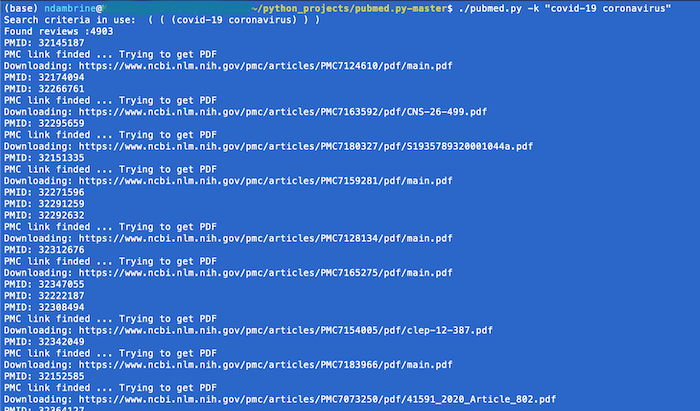

pubmed.py
=========

`pubmed.py` is an unofficial API for PubMed. 

`pubmed.py` can search for articles on PubMed and download PDF papers, free versions only, from PubMed Central. 

Use from the command-line.

Features
--------
* Multi-criteria search
* Download articles from PubMed Central (free version)
* Export results in csv file 




Setup
-----
**Note**: Use python 3
```
pip3 install -r requirements.txt
```
### Generates a PDF directory 

A directory `PDF` will be created if it does not already exist. All downloaded articles will be stored there.

### Generates an Excel File

An Excel file is automatically generated with the columns below. 
The management of duplicates is also ensured if you launch the program several times

* `pmid` : PubMed ID
* `publication_year` : Publication year
* `first_author` : First author
* `author_list` : List of authors 
* `publication_type` : Type of publication
* `journal` : Journal name
* `source` : Source
* `volume` : Volume
* `pagination` : Pagination
* `abstract` : Article's abstract
* `doi` : DOI of the article

Usage
-----
pubmed.py [-h] [-a AUTHOR] [-k [KEYWORDS]] [-o {AND,OR,NOT}]
[-ko {AND,OR,NOT}] [-d DATE] [-f FREESYNTAXE]

PubMed - Search and Download papers for you. Don't waste your time ;-)

optional arguments:

-h, --help            
>>show this help message and exit

-a AUTHOR, --author AUTHOR
>>tries to find and download papers by author. Exemple :
"Firstname J"

-k [KEYWORDS], --keywords [KEYWORDS]
>>tries to find and download papers by terms. Exemple :
"nipah bats"

-o {AND,OR,NOT}, --operator {AND,OR,NOT}
>>general operator. choose from : "OR", "AND", "NOT"

-ko {AND,OR,NOT}, --keywordsoperator {AND,OR,NOT}
>>keywords operator. choose from : "OR", "AND", "NOT"

-d DATE, --date DATE  
>>tries to find and download papers by date. YYYY/MM/DD

-f FREESYNTAXE, --freesyntaxe FREESYNTAXE
>>Free Syntax. Exclusive argument

Examples
--------
search by author
```
./pubmed.py -a "Firstname, Lastname"

>>(Firstname, Lastname[Author])
```

search by date
```
./pubmed.py -d "2017"

./pubmed.py -d "2017/01"

>>(2017/01[Date - Publication] : "3000"[Date - Publication])

>>From 2017/01 to Present
```


search by keywords
```
./pubmed.py -k "nipah bats"

>>( (nipah bats) )
```

search by keywords and  specifie keyword operator
```
./pubmed.py -k "nipah bats" -k "another" -k "keyword" -ko OR

>>( (nipah bats)    OR    (another) OR (keyword) )
```


search by free syntax if familiar : search by author AND date fixed from 2017 to present
```
./pubmed.py -f "(Firstname, Lastname[Author])  AND  (2017[Date - Publication] : "3000"[Date - Publication])"
```


search by multiple keywords , fix keyword operator to OR (AND is default) , fix general operator to NOT 
```
./pubmed.py  -k "nipah bats" -k "keyword2"  -k "keyword3" -a "Firstname,Lastname" -ko OR -a "Firstname, Lastname" -o NOT

>>( ( (nipah bats) OR (keyword2) OR (keyword3) ) ) NOT ( (Firstname, Lastname[Author]) ) 
````

## Authors

* **Naïma Dambrine** 

## License

MIT License Copyright (c) 2020 Naïma Dambrine
